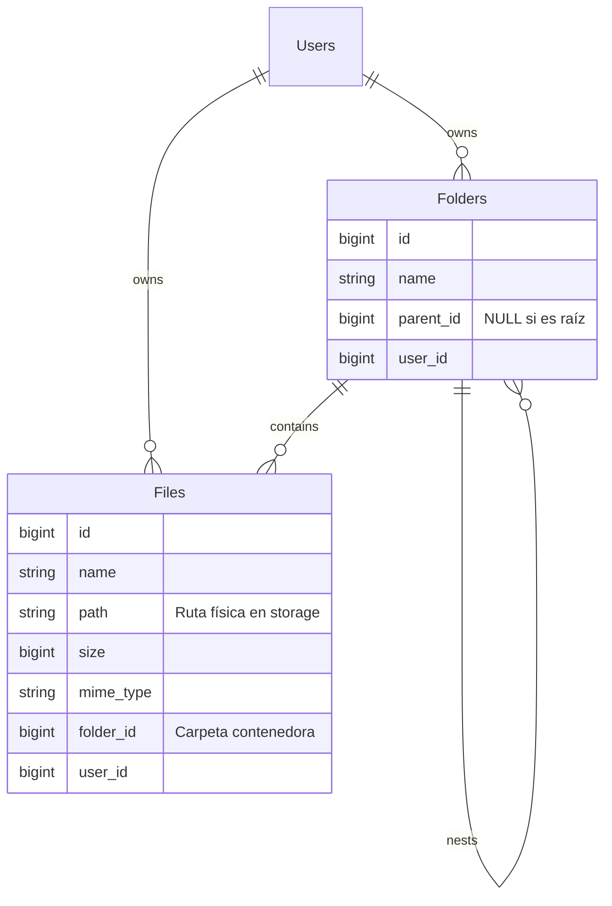

# Arquitectura de Gestión de Archivos

La implementación de Vincebus FTP utiliza un patrón **Inertia-driven Reactive State**, combinando la potencia del servidor Laravel con la fluidez de Vue 3.

## 1. Esquema de Base de Datos

La jerarquía sigue un modelo parental clásico pero escalable:

## 2. Flujo de Navegación

1. **Petición del Usuario**: Al hacer clic en una carpeta, el frontend lanza `router.get('/dashboard', { folder: ID })`.
2. **Controlador (Backend)**: El [DiskController](file:///home/vincebus/vincebus-coding/vdrive/app/Http/Controllers/DiskController.php#10-77) recibe el `folder_id` y:
    - Filtra carpetas y archivos por ese ID y el usuario autenticado.
    - Calcula recursivamente los **Breadcrumbs** subiendo por la relación [parent](file:///home/vincebus/vincebus-coding/vdrive/app/Models/Folder.php#26-30).
3. **Respuesta de Inertia**: Laravel devuelve los datos como **props** de Vue.
4. **Sincronización de Estado (Pinia)**: El componente [Dashboard.vue](file:///home/vincebus/vincebus-coding/vdrive/resources/js/Pages/Dashboard.vue) detecta el cambio en las props mediante un `watch` y actualiza el **Pinia Store** ([fileStore.js](file:///home/vincebus/vincebus-coding/vdrive/resources/js/Stores/fileStore.js)), lo que provoca que toda la interfaz se actualice reactivamente.

## 3. Ventajas de este Enfoque

- **Simplicidad**: No requiere una API REST separada; el estado viaja con la navegación.
- **Jerarquía Infinita**: Gracias a la relación `parent_id` en las carpetas, la profundidad de directorios no tiene límites técnicos.
- **Seguridad Nativa**: Al filtrar siempre por `user_id` en el controlador, garantizamos el aislamiento total de los datos entre usuarios.
